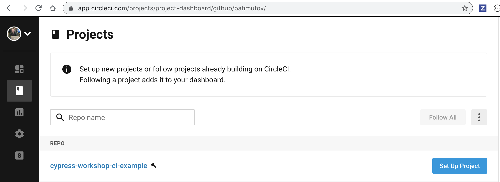
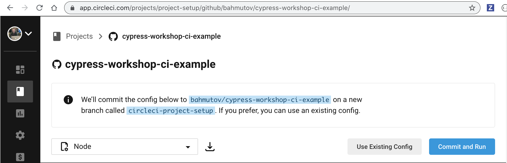
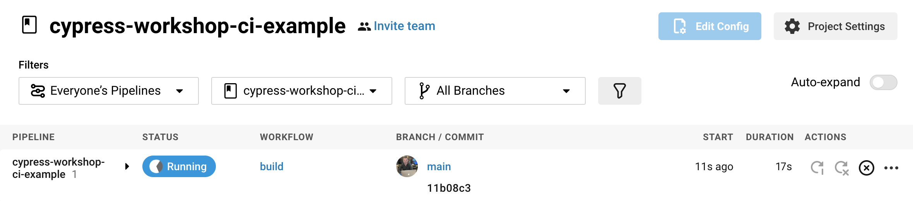
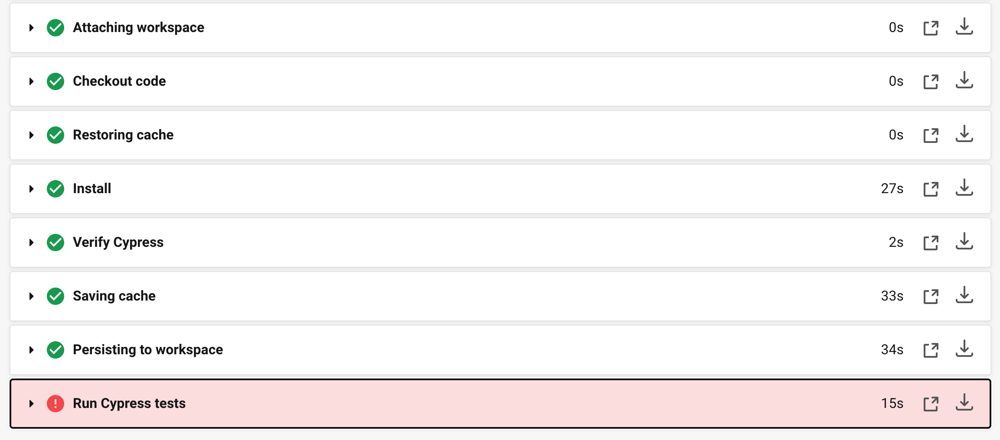
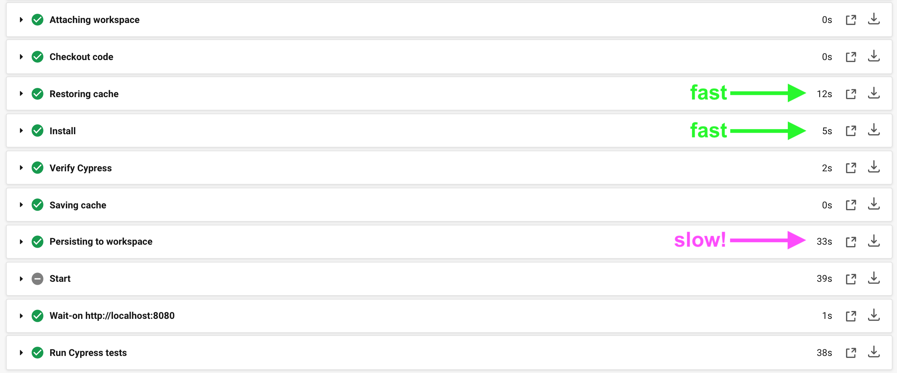
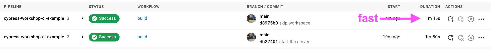
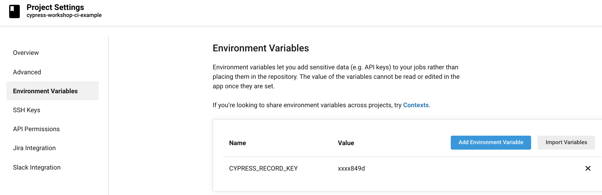
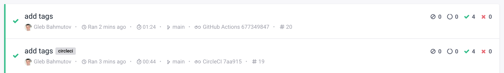

# Cypress CircleCI Orb

## 📚 You will learn

- How to **easily** run Cypress on CircleCI
- How to run Cypress tests in parallel
- How to split build and test jobs

💡 see [github.com/cypress-io/circleci-orb](https://github.com/cypress-io/circleci-orb)

---
## Motivation

You don't need to fiddle with caching, installation, flags, recording, etc. Let us (Cypress authors) write the CI configuration code.

```yml
version: 2.1
orbs:
  cypress: cypress-io/cypress@1
# use cypress orb in your workflow
```

Repo [github.com/cypress-io/circleci-orb](https://github.com/cypress-io/circleci-orb)

---
### TODO: try running the simplest job

Create file `circle.yml` in the root of the repo

```yml
version: 2.1
orbs:
  cypress: cypress-io/cypress@1
workflows:
  build:
    jobs:
      # "cypress" is the name of the imported orb
      # "run" is the name of the job defined in Cypress orb
      - cypress/run
```

Commit and push the code.

+++
### Create CircleCI project


+++
### Use existing config file



+++
### Start building



+++
### Build steps



+++
### TODO: fix the build

Need to start the server and wait for the URL to respond

**💡 Hint:** look at the examples in [github.com/cypress-io/circleci-orb](https://github.com/cypress-io/circleci-orb)

+++

```yml
version: 2.1
orbs:
  cypress: cypress-io/cypress@1
workflows:
  build:
    jobs:
      # "cypress" is the name of the imported orb
      # "run" is the name of the job defined in Cypress orb
      - cypress/run:
          start: npm start
          wait-on: 'http://localhost:8080'
```

---



+++

### Todo: remove "persisting to workspace" step

We only have the single test job, and do not intend to run any more jobs using this workspace. Thus we can skip saving the workspace to save time.

**💡 Hint:** look at the examples in [github.com/cypress-io/circleci-orb](https://github.com/cypress-io/circleci-orb)

+++

```yml
version: 2.1
orbs:
  cypress: cypress-io/cypress@1
workflows:
  build:
    jobs:
      - cypress/run:
          start: npm start
          wait-on: 'http://localhost:8080'
          no-workspace: true
```

+++


---
### Record the test results

- Look up the project's recording key at `https://dashboard.cypress.io/projects/<id>/settings`
- Add to the CircleCI project's settings

+++

+++

### TODO: Set the project to record

Look up the record option at [github.com/cypress-io/circleci-orb](https://github.com/cypress-io/circleci-orb)

**Bonus:** add tag to separate the recorded runs from CircleCI from other CIs
+++

```yml
version: 2.1
orbs:
  cypress: cypress-io/cypress@1
workflows:
  build:
    jobs:
      # "cypress" is the name of the imported orb
      # "run" is the name of the job defined in Cypress orb
      - cypress/run:
          start: npm start
          wait-on: 'http://localhost:8080'
          no-workspace: true
          record: true
          tags: circleci
```

+++



---
## CircleCI Orb is a text macro expansion

Can be checked statically via CircleCI CLI [https://circleci.com/docs/2.0/local-cli/](https://circleci.com/docs/2.0/local-cli/)

```
$ circleci config validate circle.yml
Config file at circle.yml is valid.
```
+++

But if we tried to use `tag` instead of `tags`

```
$ circleci config validate circle.yml
Error: Error calling workflow: 'build'
Error calling job: 'cypress/run'
Unexpected argument(s): tag
```
+++

We can see the "effective" config after Orb has been expanded in the workflow

```
$ circleci config process circle.yml
# Orb 'cypress-io/cypress@1' resolved to 'cypress-io/cypress@1.27.0'
version: 2
jobs:
  cypress/run:
    docker:
    - image: cypress/base:10
    parallelism: 1
    environment:
    - CYPRESS_CACHE_FOLDER: ~/.cache/Cypress
    steps:
    - run:
        command: echo "Assuming dependencies were installed using cypress/install job"
    - attach_workspace:
        at: ~/
    - checkout
    - restore_cache:
        keys:
        - cache-{{ arch }}-{{ .Branch }}-{{ checksum "package.json" }}
    - run:
        name: Install
        working_directory: ''
        command: "if [[ ! -z \"\" ]]; then\n  echo \"Installing using custom command\"\n  echo \"\"\n  \nelif [ \"false\" = \"true\" ]; then\n  echo \"Installing using Yarn\"\n  yarn install --frozen-lockfile\nelif [ ! -e ./package-lock.json ]; then\n  echo \"The Cypress orb uses 'npm ci' to install 'node_modules', which requires a 'package-lock.json'.\"\n  echo \"A 'package-lock.json' file was not found. Please run 'npm install' in your project,\"\n  echo \"and commit 'package-lock.json' to your repo.\"\n  exit 1\nelse\n  echo \"Installing dependencies using NPM ci\"\n  npm ci\nfi\n"
    - run:
        name: Verify Cypress
        command: npx cypress verify
        working_directory: ''
    - save_cache:
        key: cache-{{ arch }}-{{ .Branch }}-{{ checksum "package.json" }}
        paths:
        - ~/.npm
        - ~/.cache
    - run:
        name: Start
        command: npm start
        background: true
        working_directory: ''
    - run:
        name: Wait-on http://localhost:8080
        command: npx wait-on http://localhost:8080
    - run:
        name: Run Cypress tests
        no_output_timeout: 10m
        command: |
          npx cypress run \
             \
             \
             \
             \
             --record \
               \
               \
               --tag 'circleci'  \
               \
        working_directory: ''
workflows:
  build:
    jobs:
    - cypress/run
  version: 2
```
