# Cypress on Generic CI

Using [GitHub Actions](https://glebbahmutov.com/blog/trying-github-actions/) as a demo

## 📚 You will learn

- Cypress Docker images for dependencies
- Installing and caching Cypress itself
- How to start server and run Cypress tests
- How to record test artifacts

💡 All our docs are at [https://on.cypress.io/ci](https://on.cypress.io/ci)

---
### GH Actions workflow

Create new file `.github/workflows/ci.yml` and paste the following

```yml
name: ci
on: [push]
jobs:
  build-and-test:
    runs-on: ubuntu-20.04
    steps:
      - name: Checkout 🛎
        uses: actions/checkout@v2

      - name: Install dependencies 📦
        run: npm ci

      - name: Build the app 🏗
        run: npm run build

      - name: Start the app 📤
        run: npm start &

      - name: Run Cypress tests 🧪
        run: npm run cy:run
```

📖 [GH Actions workflow syntax docs](https://docs.github.com/en/actions/reference/workflow-syntax-for-github-actions)

+++
## GitHub Actions tab

Commit the code and push back to GitHub. Then pick the Actions tab

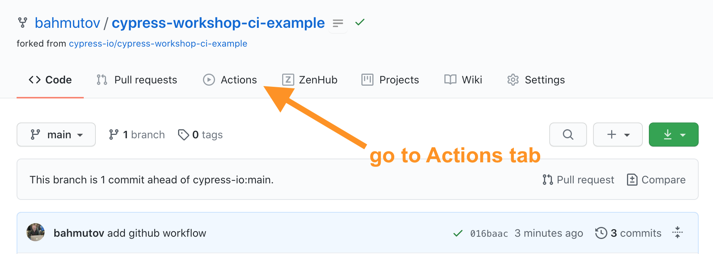

+++
## Passed GH workflow

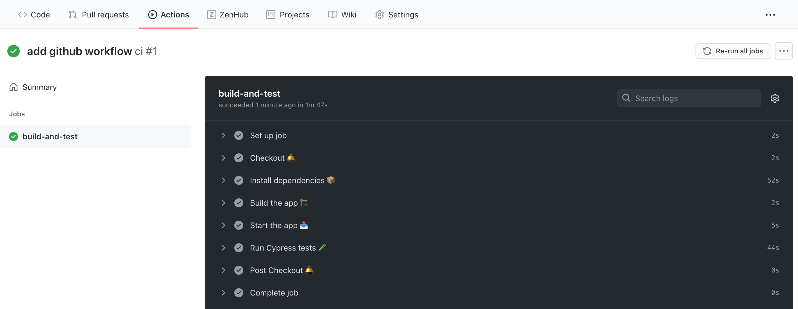

+++
### Common problems: OS

Typically Windows and Mac machines should have everything necessary to run Cypress. Linux CI machines sometimes might need extra libraries to run Cypress.

- 🚨 Cypress does not run in your Linux CI container
- ✅ Check OS dependencies [on.cypress.io/ci#Dependencies](https://on.cypress.io/ci#Dependencies)
- ✅ Use [cypress/base](https://github.com/cypress-io/cypress-docker-images#cypress-docker-images-) Docker image

💡 **Tip:** use `npx cypress verify` to make sure Cypress can run

+++
### Common problems: min requirements

- 🚨 Browser crashes
- 🚨 Video pauses or freezes
- 🚨 Tests are very slow
- ✅ See our notes at [on.cypress.io/ci#Machine-requirements](https://on.cypress.io/ci#Machine-requirements)

---
## 💡 Flakey CI

If your tests work locally but are flakey on CI:
- differences in timing, data, browser

Search our documentation


---
## Caching

Running tests on CI is like getting a brand new laptop every day - you have to install everything from scratch. It takes time!

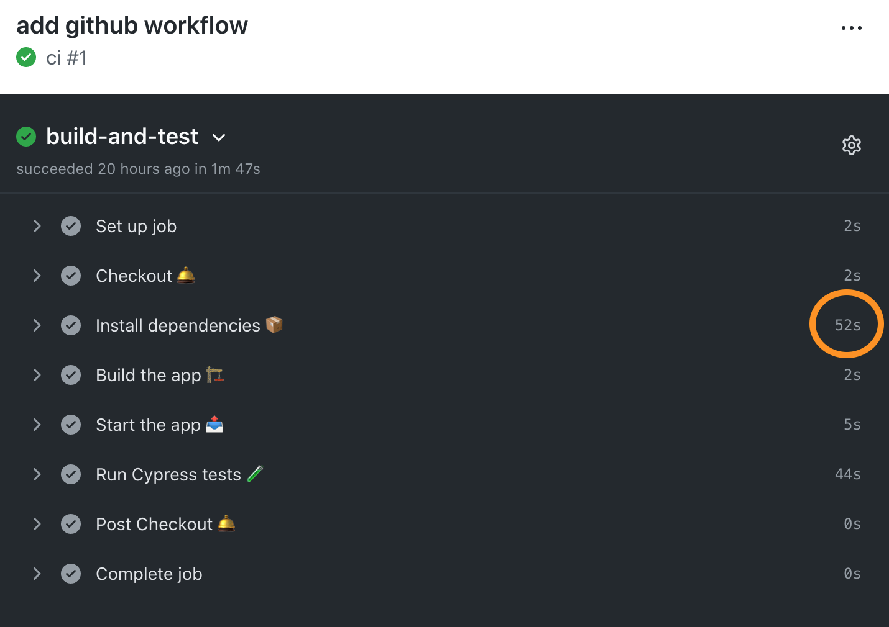

+++
## What to cache?

- Caching `node_modules` **not recommended**
- If using NPM to install dependencies
  - use `npm ci`
  - cache `~/.npm` and `~/.cache/Cypress` folders
- If using Yarn to install dependencies
  - use `yarn install --frozen-lockfile`
  - cache `~/.cache` folder

**Tip:** Cypress cache command

```
$ npx cypress cache path
```

See 📚 at [on.cypress.io/caching](https://on.cypress.io/caching)

+++
Update workflow with caching

```yml
name: ci
on: [push]
jobs:
  build-and-test:
    runs-on: ubuntu-20.04
    steps:
      - name: Checkout 🛎
        uses: actions/checkout@v2

      - name: Cache dependencies 💎
        uses: actions/cache@v2
        with:
          path: |
            ~/.cache
            ~/.npm
          # use key string with "v1" for simple cache invalidation
          # use precise key to avoid cache "snowballing"
          # https://glebbahmutov.com/blog/do-not-let-cypress-cache-snowball/
          key: dependencies-v1-${{ runner.os }}-${{ hashFiles('**/package-lock.lock') }}

      - name: Install dependencies 📦
        run: npm ci

      - name: Show Cypress info ℹ️
        run: npx cypress info

      - name: Verify Cypress can run 🏃‍♂️
        run: npx cypress verify

      - name: Build the app 🏗
        run: npm run build

      - name: Start the app 📤
        run: npm start &

      - name: Run Cypress tests 🧪
        run: npm run cy:run
```

Push a few commits to see the caching timings

+++
## Caching works

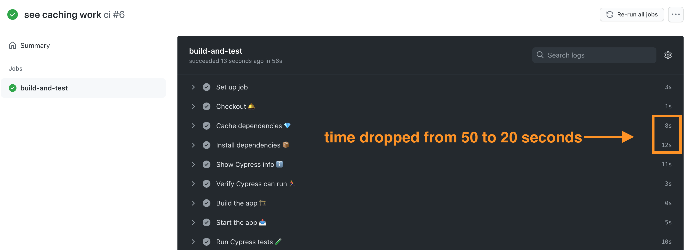

+++
## ⚠️ Caching usually needs two commands

Typically CIs have one command to restore previous cache and another command to save the cache.

```yml
# CircleCI
- restore_cache:
    keys:
      - dependencies-{{ checksum "package.json" }}
- run: npm ci
# tip: cache the verified status
- run: npx cypress verify
- save_cache:
    key: dependencies-{{ checksum "package.json" }}
    paths:
    - ~/.npm
    - ~/.cache
```
+++
## ⚠️ Use precise cache key

```yml
- restore_cache:
    keys:
      - dependencies-{{ checksum "package.json" }}
      # 🚨 NOT RECOMMENDED fallback cache key
      - dependencies-
```

Check how many versions of Cypress you have after install

```
npx cypress cache list
```

```yml
- restore_cache:
    keys:
      # ✅ use single precise cache key
      - dependencies-{{ checksum "package-lock.json" }}
```

Read [https://glebbahmutov.com/blog/do-not-let-cypress-cache-snowball/](https://glebbahmutov.com/blog/do-not-let-cypress-cache-snowball/)

---
### Wait for the application to start

Sometimes the `npm start` takes a while to launch the application.

```yml
- name: Start the app 📤
  run: npm start &
- name: Wait for URL ⏰
  run: npx wait-on http://localhost:8080
```

Use utility like [wait-on](https://github.com/jeffbski/wait-on#readme)
---
### 💡 Skip Cypress binary install

Set an environment variable to skip the Cypress installation

```
CYPRESS_INSTALL_BINARY=0
```

If you want to force install again `npx cypress install`

See 📚 [on.cypress.io/installing](https://on.cypress.io/installing)
---
### 💡 Single command to start and test

Check out utility [start-server-and-test](https://github.com/bahmutov/start-server-and-test)

```
$ npm i -D start-server-and-test
+ start-server-and-test@1.12.1
```

```json
{
  "scripts": {
    "start": "eleventy --serve",
    "build": "eleventy",
    "cy:open": "cypress open",
    "cy:run": "cypress run",
    "e2e": "start-test 8080 cy:run"
  }
}
```

On CI run `npm run e2e`

```yml
- name: Build the app 🏗
  run: npm run build

- name: Run Cypress tests 🧪
  run: npm run e2e
```

---
### 🤷‍♂️ What happens when a test fails on CI?

```diff
- cy.location('pathname').should('equal', '/README/')
+ cy.location('pathname').should('equal', '/READMEZ/')
```

+++
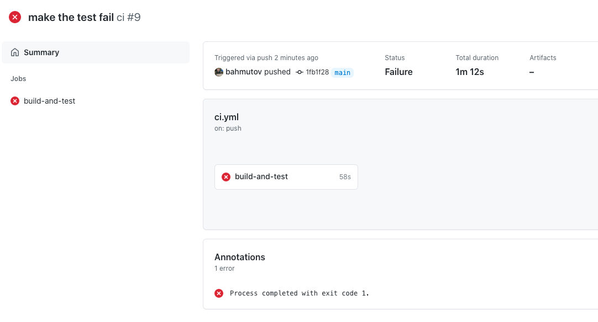

+++
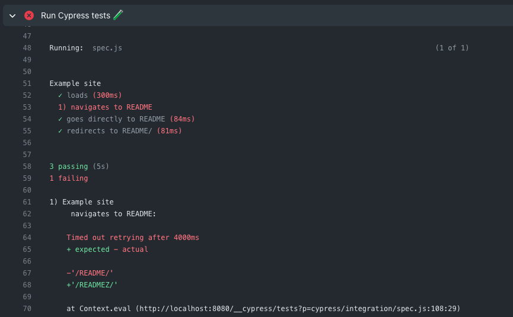

+++
### Where are the screenshots and videos?

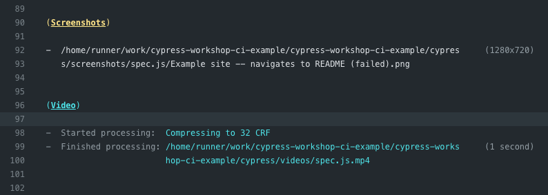

When using `cypress run` Cypress automatically records the video of the entire test run and takes a screenshot on failure.
+++
### Store test artifacts (CI-specific)

```yml
- name: Run Cypress tests 🧪
  run: npm run e2e

- name: Upload any screenshots and videos 📼
  uses: actions/upload-artifact@v2
  # make sure to run this step
  # even if the previous step fails
  if: always()
  with:
    name: test-artifacts
    path: |
      cypress/videos
      cypress/screenshots
```
+++
### Job test artifacts

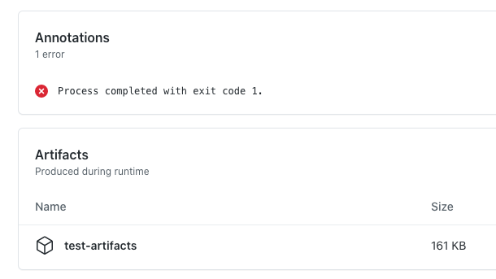
+++
### Downloaded unzipped files

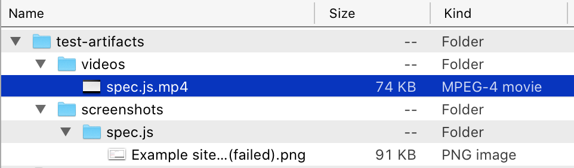
+++
### Test screenshot showing the failure


---
## 🎥 Record test artifacts on Cypress Dashboard

- CI-agnostic
- all information in one place
- parallelization, analytics, flake detection, other benefits
- GitHub, GitLab, Bitbucket, Slack integrations
- free plan [www.cypress.io/pricing](https://www.cypress.io/pricing)

+++
### Set up the project to record

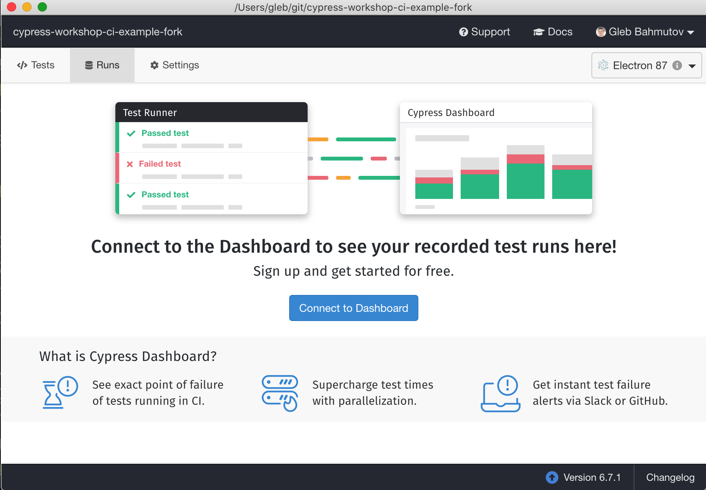
+++
### Pick organization

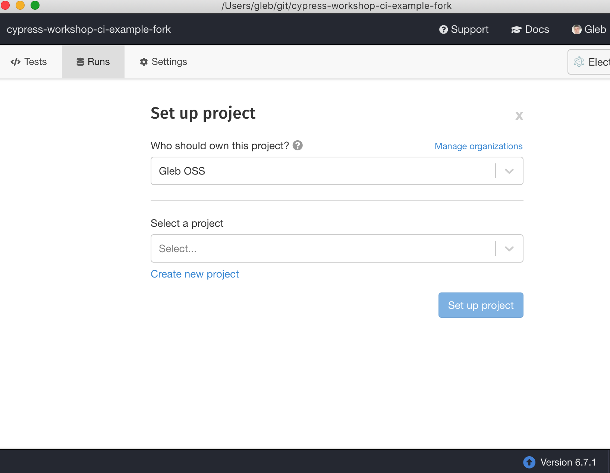
+++
### Create new project
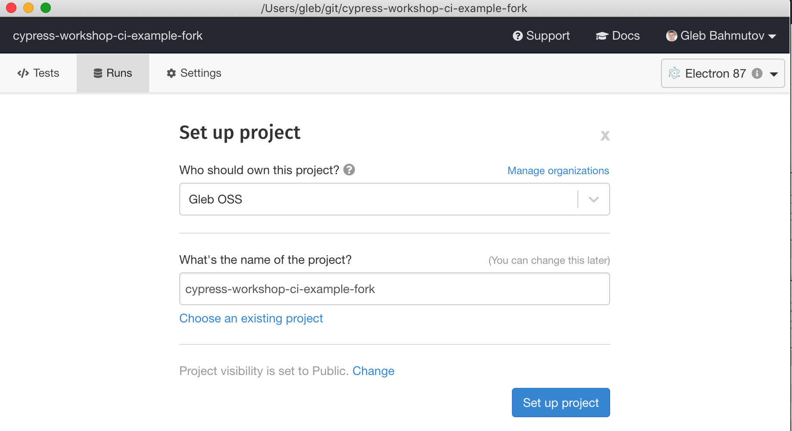
+++
### Copy the secret record key
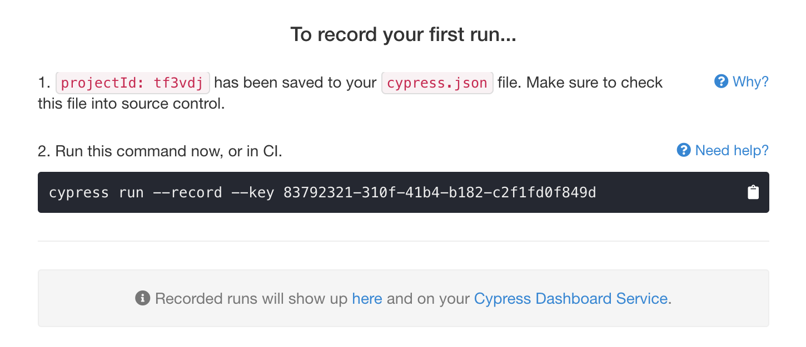
+++
### Set the record key on CI
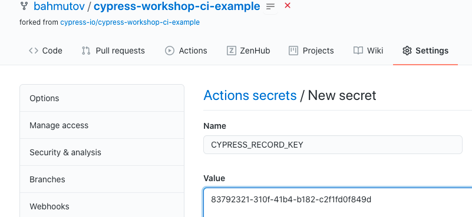
+++
Use `cypress run --record` command

```yml
- name: Start the app 📤
  run: npm start &

- name: Run Cypress tests 🧪
  run: npx cypress run --record
  env:
    # pass the record key as environment variable
    # during this CI step
    CYPRESS_RECORD_KEY: ${{ secrets.CYPRESS_RECORD_KEY }}
```

+++
### The recorded run URL


+++
### Dashboard run

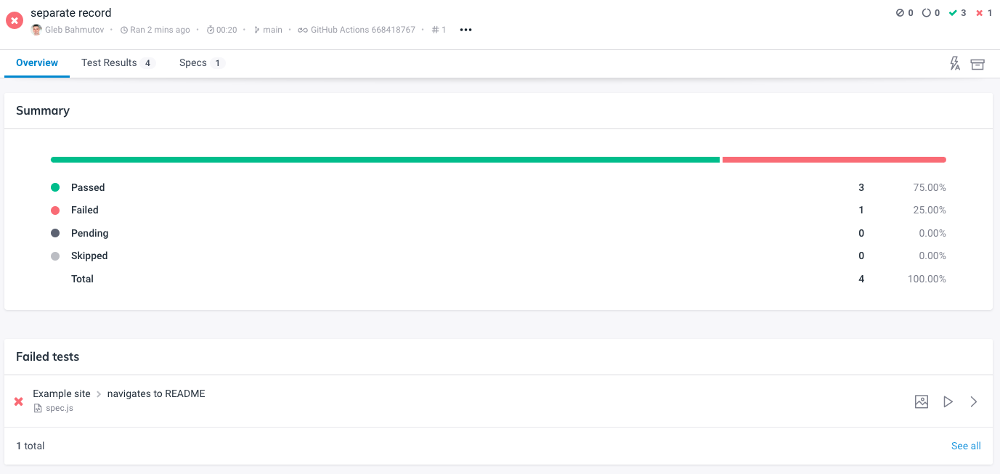

Debug the failure by watching the movie and inspecting the error screenshots

---
### TODO: Run the tests in different browser

- find the available browsers installed on CI
- use `cypress run --record --browser ...` to pick the browser

---
### TODO: Run the tests on a different OS

- `runs-on: ubuntu-20.04`
- `runs-on: windows-latest`
- `runs-on: macos-latest`

+++
### Run tests on every OS

```yml
jobs:
  build-and-test:
    strategy:
      # do not stop the matrix if one of the jobs fails
      fail-fast: false
      matrix:
        os: [macos-latest, windows-latest, ubuntu-20.04]
    runs-on: ${{ matrix.os }}
```

📝 [glebbahmutov.com/blog/trying-github-actions](https://glebbahmutov.com/blog/trying-github-actions)

+++
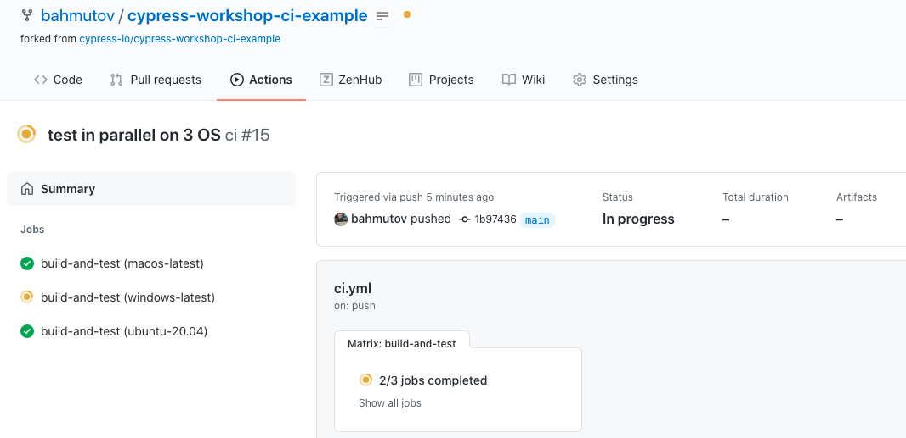

---
**TODO:** Add README badge


---
## ⌛️ Review

- installing and caching Cypress on CI
- running the server and waiting for the URL to respond
- downloading the test artifacts
- recording on Cypress Dashboard

📚 Cypress documentation [https://on.cypress.io/ci](https://on.cypress.io/ci)
