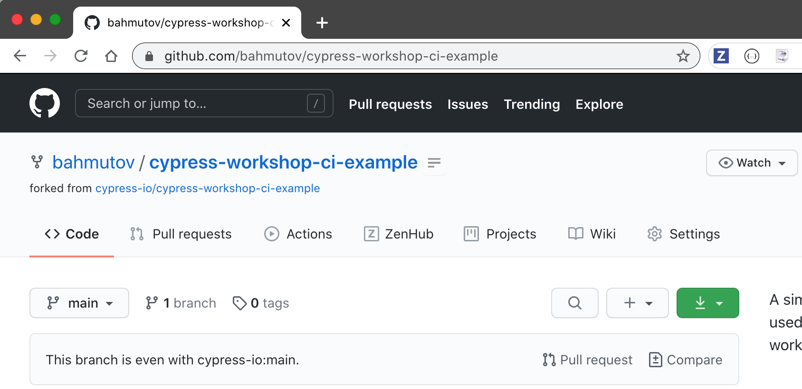
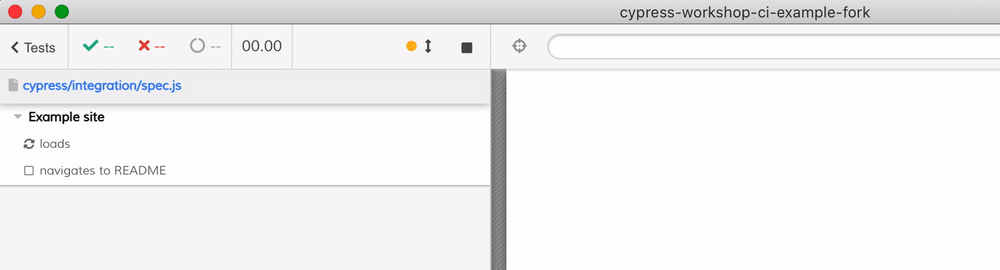

# Cypress Continuous Integration Workshop

How to run Cypress on popular CI services

Code at [github.com/cypress-io/cypress-workshop-ci](https://github.com/cypress-io/cypress-workshop-ci)

Jump to: [Generic CI](/?p=generic-ci), [GitHub Action](/?p=github-action)

---
## Gleb Bahmutov, PhD

- Distinguished Engineer at Cypress
- gleb (at) cypress.io
- [@bahmutov](https://twitter.com/bahmutov)
- [https://glebbahmutov.com/blog/tags/cypress/](https://glebbahmutov.com/blog/tags/cypress/)
- [https://www.youtube.com/glebbahmutov](https://www.youtube.com/glebbahmutov)

---
## What we are going to cover

1. How to correctly run Cypress on any CI
2. How to **easily** run Cypress on GitHub Actions
3. How to **easily** run Cypress on CircleCI
4. How to **easily** run Cypress on Netlify Build

---
**Warning: ⚠️** this is not an introduction to Cypress testing workshop, only how to successfully run it in CI. If you need to refresh your Cypress skills, check out [testing-workshop-cypress](https://github.com/cypress-io/testing-workshop-cypress)

✅ This workshop includes all the slides and links I am showing, so you can return to it later <!-- .element: class="fragment" -->

---
## Logistics

### Time 🕰
- total workshop duration 3 hours
- 10 minute break after each hour

### Remote Workshop 🖥
- I will go through all steps
- you try to follow along by doing the same steps

### Questions ⁉️
- post to chat, I will try to answer them along the way

---
## Requirements

You will need:

- `git` to clone the repository
- Node v12+ to install and run locally
- 👉 fork the [cypress-io/cypress-workshop-ci-example](https://github.com/cypress-io/cypress-workshop-ci-example) now 👈

### Create free accounts

- GitHub [https://github.com/](https://github.com/)
- CircleCI [https://circleci.com/](https://circleci.com/)
- Netlify [https://www.netlify.com/](https://www.netlify.com/)
- Cypress Dashboard [https://dashboard.cypress.io/](https://dashboard.cypress.io/)

---
## Forked example repo


---
## Clone to local machine

```
git clone git@github.com:bahmutov/cypress-workshop-ci-example.git cypress-workshop-ci-example-fork
cd cypress-workshop-ci-example-fork
```
+++
## Inspect the application

```
$ ls -l
total 384
-rw-r--r--  1 gleb  staff     163 Mar 17 12:47 README.md
drwxr-xr-x  3 gleb  staff      96 Mar 17 12:47 cypress
-rw-r--r--  1 gleb  staff     116 Mar 17 12:47 cypress.json
-rw-r--r--  1 gleb  staff     597 Mar 17 12:47 index.html
-rw-r--r--  1 gleb  staff  177299 Mar 17 12:47 package-lock.json
-rw-r--r--  1 gleb  staff     865 Mar 17 12:47 package.json
```

It is a static site build with [11ty](https://www.11ty.dev/)
+++
## Look at the NPM scripts
```
$ npm run
Lifecycle scripts included in cypress-workshop-ci-example:
  start
    eleventy --serve

available via `npm run-script`:
  build
    eleventy
  cy:open
    cypress open
  cy:run
    cypress run
```

+++
## Look at cypress.json

```
$ cat cypress.json
{
  "fixturesFolder": false,
  "supportFile": false,
  "pluginsFile": false,
  "baseUrl": "http://localhost:8080"
}
```
+++
## Look at cypress/integration

```bash
$ cat cypress/integration/spec.js
```

```js
/// <reference types="cypress" />

describe('Example site', () => {
  it('loads', () => {
    cy.visit('/')
    cy.contains('h1', 'cypress-workshop-ci-example').should('be.visible')
  })

  it('navigates to README', () => {
    cy.visit('/')
    cy.contains('a', 'README').click()
    cy.location('pathname').should('equal', '/README/')
  })

  it('goes directly to README', () => {
    cy.visit('/README')
    cy.contains('h2', 'README')
  })

  it('redirects to README/', () => {
    cy.visit('/README/')
    cy.contains('h2', 'README')
  })
})
```

---
## Install dependencies

Use either `npm i` or `npm ci`

```
$ npm i
...
> cypress@6.7.1 postinstall /Users/gleb/git/cypress-workshop-ci-example-fork/node_modules/cypress
> node index.js --exec install


Cypress 6.7.1 is installed in /Users/gleb/Library/Caches/Cypress/6.7.1

added 570 packages from 551 contributors and audited 570 packages in 9.072s
```

+++
## 💡 Cypress binary

- NPM modules are installed in `node_modules`
- Cypress Electron binary is installed _where_?

```
$ npx cypress info
Displaying Cypress info...
...
Application Data: /Users/gleb/Library/Application Support/cypress/cy/development
Browser Profiles: /Users/gleb/Library/Application Support/cypress/cy/development/browsers
Binary Caches: /Users/gleb/Library/Caches/Cypress

Cypress Version: 6.7.1
System Platform: darwin (19.6.0)
System Memory: 17.2 GB free 270 MB
```

📚 docs at [on.cypress.io/command-line#cypress-info](https://on.cypress.io/command-line#cypress-info)

+++
## How do I run the site locally?

- from the terminal `npm start`
  - the app starts at `localhost:8080`

```
$ npm start

> cypress-workshop-ci-example@1.0.0 start /Users/gleb/git/cypress-workshop-ci-example-fork
> eleventy --serve

Writing _site/README/index.html from ./README.md.
Writing _site/index.html from ./index.html.
Wrote 2 files in 0.17 seconds (v0.11.1)
Watching…
[Browsersync] Access URLs:

       Local: http://localhost:8080
    External: http://10.0.0.126:8080

          UI: http://localhost:3001
 UI External: http://localhost:3001

[Browsersync] Serving files from: _site
```

+++
## What does the app build?

- output folder `_site`
- production build `npm run build`

```
$ npm run build

> cypress-workshop-ci-example@1.0.0 build /Users/gleb/git/cypress-workshop-ci-example
> eleventy

Writing _site/README/index.html from ./README.md.
Writing _site/index.html from ./index.html.
Wrote 2 files in 0.10 seconds (v0.11.1)
```

+++
## Run tests locally

While the application is running in one terminal, from the second terminal exeucute `npm run cy:open`



---
## Continuous Integration

Build the app and run the tests on CI
- on every commit
- on every pull request

Goal 🥅 is to have full confidence in the deployed application

Next: [Generic CI](/?p=generic-ci)
