# Cypress Netlify Build Plugin

## 📚 You will learn

- How to **easily** run Cypress on Netlify
- How to run tests after the deploy
- How to run tests before the deploy

💡 see [github.com/cypress-io/netlify-plugin-cypress](https://github.com/cypress-io/netlify-plugin-cypress)

---
## Motivation

Deploying a web application to Netlify is very simple, and adding Cypress E2E to the deploy process via `netlify-plugin-cypress` is a breeze

Repo [github.com/cypress-io/netlify-plugin-cypress](https://github.com/cypress-io/netlify-plugin-cypress)

---
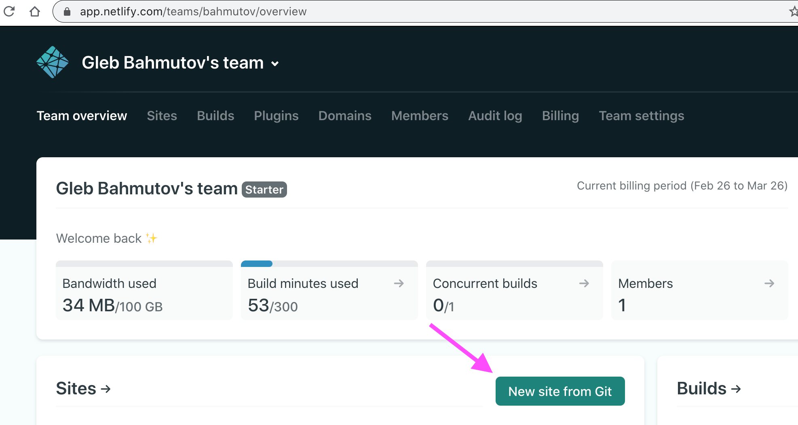

+++
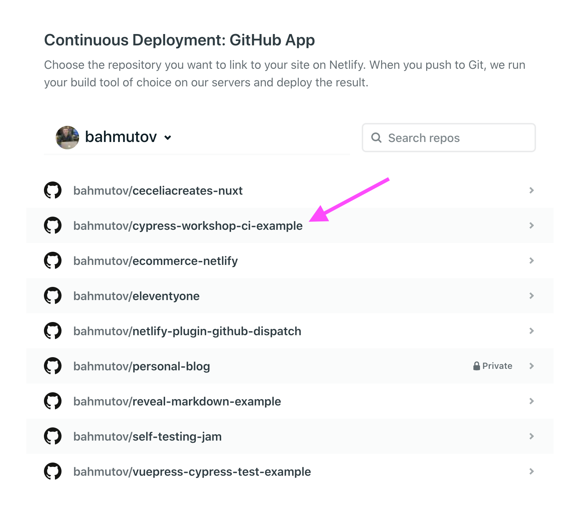

+++
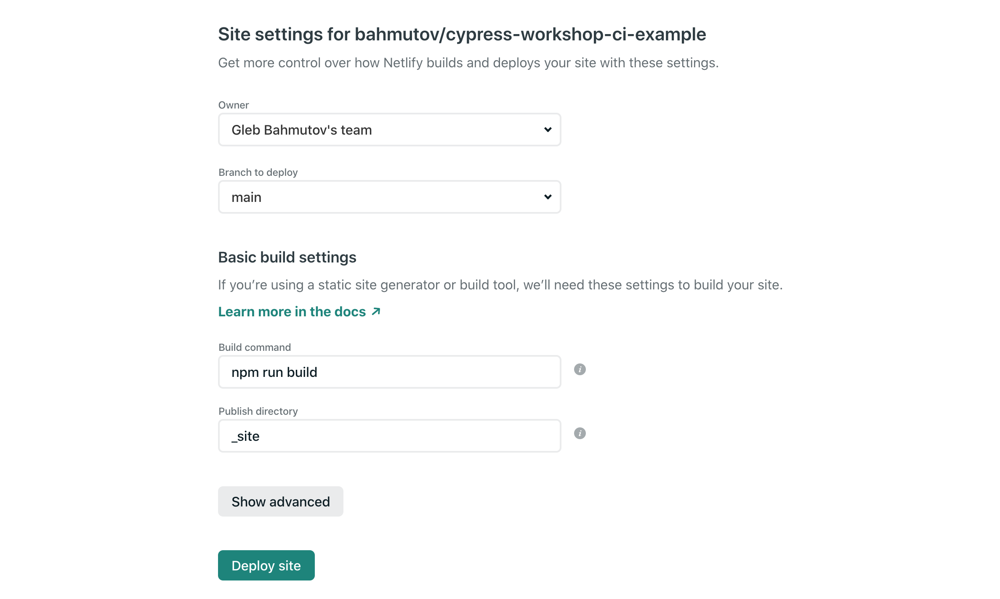

+++
### You can change the site name

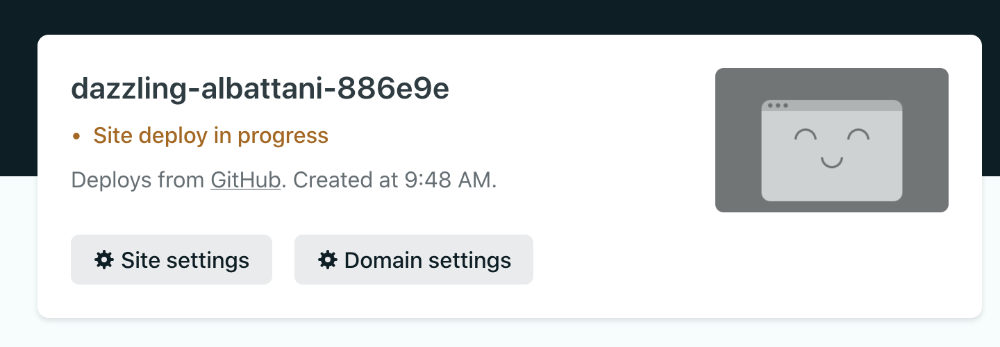

---
## Use Netlify.toml file

Instead of the deploy settings in Netlify GUI

- explicit settings
- tracked in source control

+++
`netlify.toml` file

```toml
[build]
command = "npm run build"
publish = "_site"
```
+++
### Inspect the build log

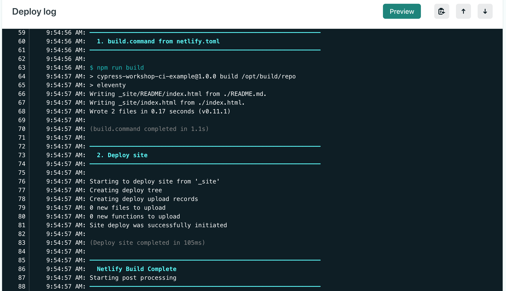

---
## Let's start testing

```
$ npm i -D netlify-plugin-cypress
+ netlify-plugin-cypress@2.1.0
```

```toml
[build]
command = "npm run build"
publish = "_site"
[[plugins]]
  package = "netlify-plugin-cypress"
```

💡 see [github.com/cypress-io/netlify-plugin-cypress](https://github.com/cypress-io/netlify-plugin-cypress)

+++

### Inspect the build log

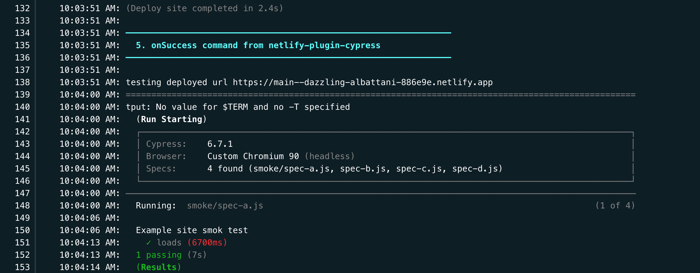

+++
### Fix the warning

```
tput: No value for $TERM and no -T specified
```

```toml
[build]
command = "npm run build"
publish = "_site"
[build.environment]
  TERM = "xterm"
[[plugins]]
  package = "netlify-plugin-cypress"
```

---
### Note that the tests are failing

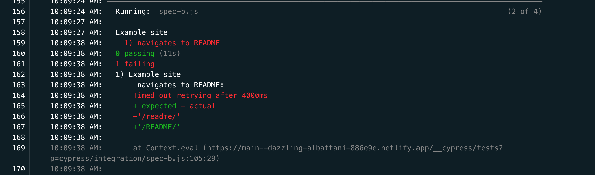

+++
### TODO set up test recording

💡 Tip: see [github.com/cypress-io/netlify-plugin-cypress](https://github.com/cypress-io/netlify-plugin-cypress)

+++
```toml
[build]
command = "npm run build"
publish = "_site"
[build.environment]
  TERM = "xterm"
[[plugins]]
  package = "netlify-plugin-cypress"
  [plugins.inputs]
    record = true
```
+++


+++

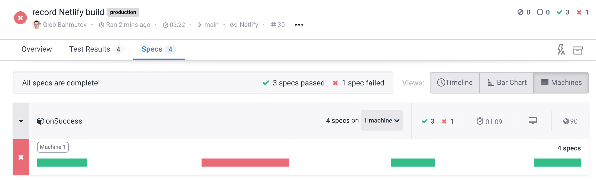

---
### TODO: fix the test

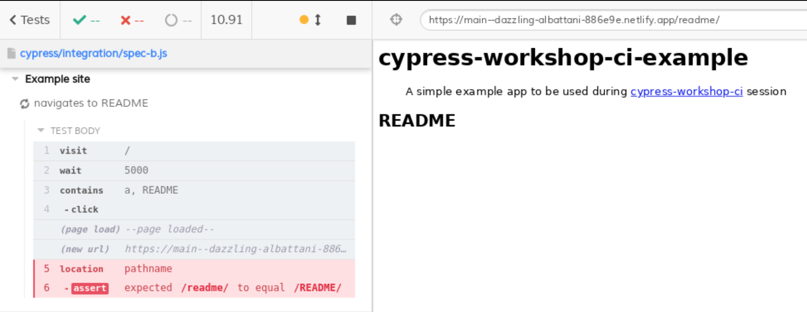

+++
```diff
- cy.location('pathname').should('equal', '/README/')
+ cy.location('pathname').should('match', /\/readme\//i)
```

---
### TODO: set your tag and group names

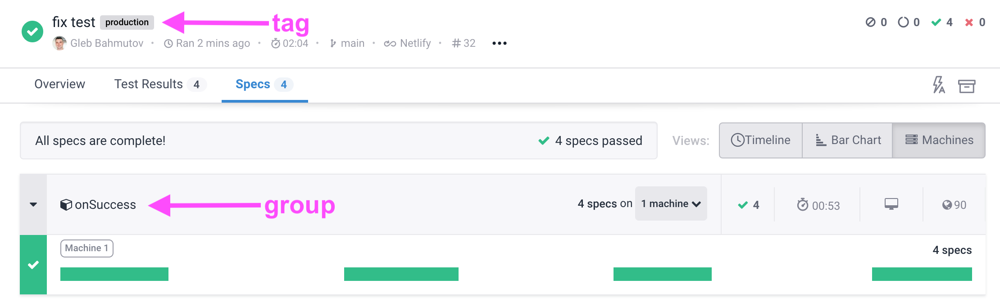

💡 Tip: see [github.com/cypress-io/netlify-plugin-cypress](https://github.com/cypress-io/netlify-plugin-cypress)

---
> Why is Netlify deploy green if the E2E tests failed?

Full answer in the webinar "Build, Deploy, and Test" https://cypress.slides.com/cypress-io/build-deploy-and-test

+++
### Deploy phases

- Start
  - *preBuild*
- Build
  - *postBuild*
- Deploy
  - *onSuccess*

By default, Cypress tests run in the "onSuccess" step

+++
### Enable tests in *preBuild*

💡 Tip: see [github.com/cypress-io/netlify-plugin-cypress](https://github.com/cypress-io/netlify-plugin-cypress)

+++
```toml
[build]
command = "npm run build"
publish = "_site"
[build.environment]
  TERM = "xterm"
[[plugins]]
  package = "netlify-plugin-cypress"
  [plugins.inputs]
    record = true
  # run Cypress tests before building and deploying
  [plugins.inputs.preBuild]
    enable = true
    # call the same commands as we do locally
    start = 'eleventy --serve'
    wait-on = 'http://localhost:8080'
    record = true
```

---
**Todo:** run all tests pre-deploy and smoke tests after deploy

💡 Tip: see [github.com/cypress-io/netlify-plugin-cypress](https://github.com/cypress-io/netlify-plugin-cypress)

---
## Netlify Build uses 1 machine

💡 If you need to run lots of tests after deploy you might want to use another CI, for example [github.com/bahmutov/netlify-plugin-github-dispatch](https://github.com/bahmutov/netlify-plugin-github-dispatch)

---
## GitHub Status Checks

We want Cypress Dashboard to set the status on every pull request.

- Cypress GH App [on.cypress.io/github-integration](https://on.cypress.io/github-integration)
- Cypress GitLab integration [on.cypress.io/gitlab-integration](https://on.cypress.io/gitlab-integration)
- Bitbucket integration [on.cypress.io/bitbucket-integration](https://on.cypress.io/bitbucket-integration)

+++
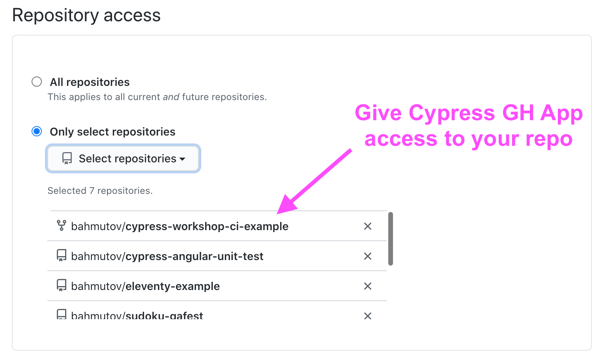

+++
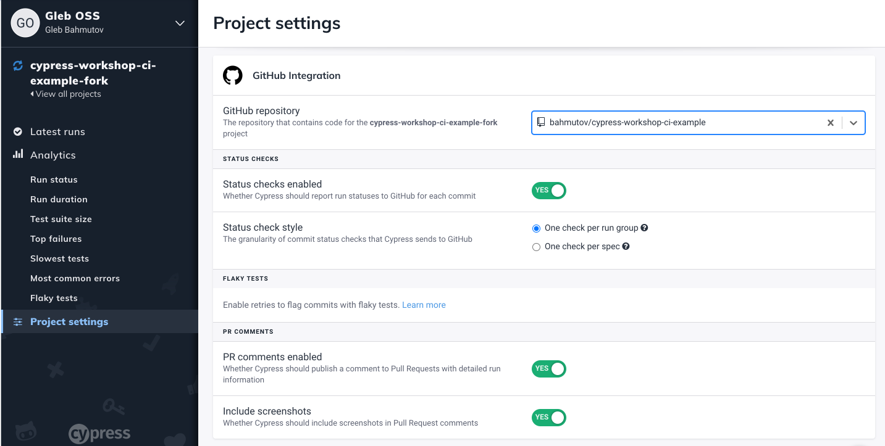

+++
## Open a new pull request

**🚨 use your repo** and not `cypress-io/cypress-workshop-ci-example`

+++
### See the GitHub status checks

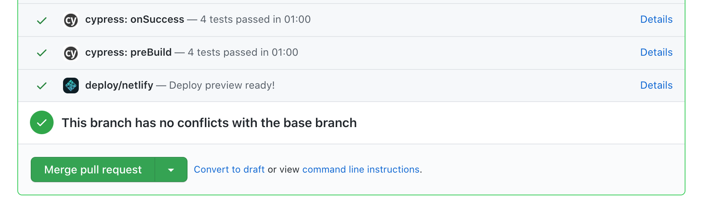

---
## ⌛️ Review

- use the [github.com/cypress-io/netlify-plugin-cypress](https://github.com/cypress-io/netlify-plugin-cypress) to run E2E tests as part of Netlify Build
- record test results to Cypress Dashboard
- run tests pre-deploy and use Cypress GitHub Integration App

Jump to: [Generic CI](/?p=generic-ci), [GitHub Action](/?p=github-action), [CircleCI](/?p=circleci), [Netlify Build](/?p=netlify-build)
